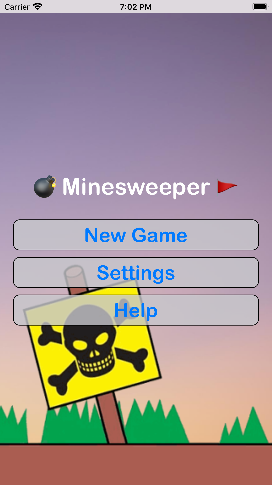
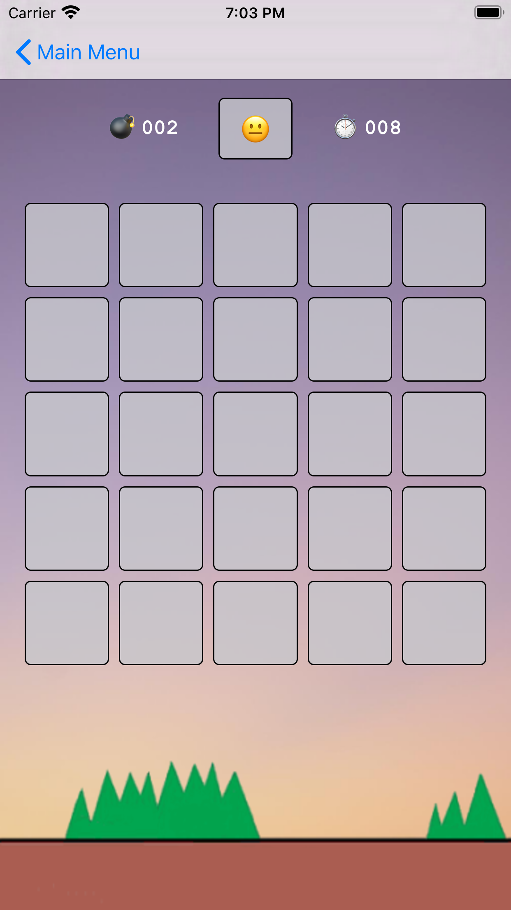
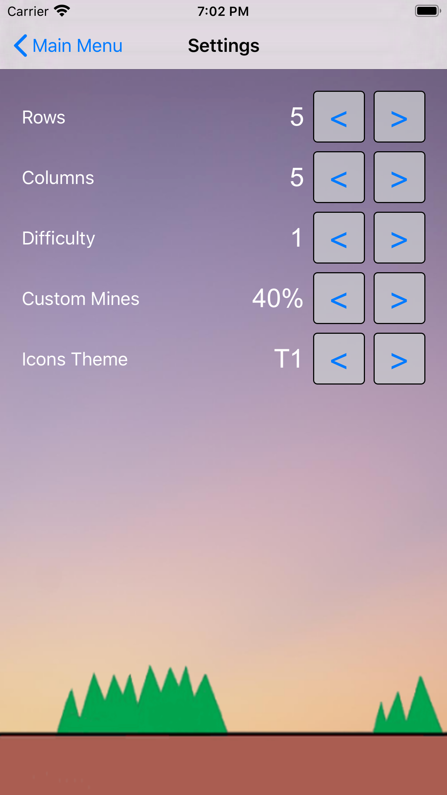
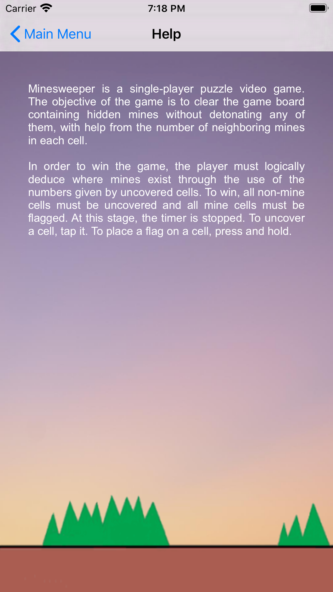
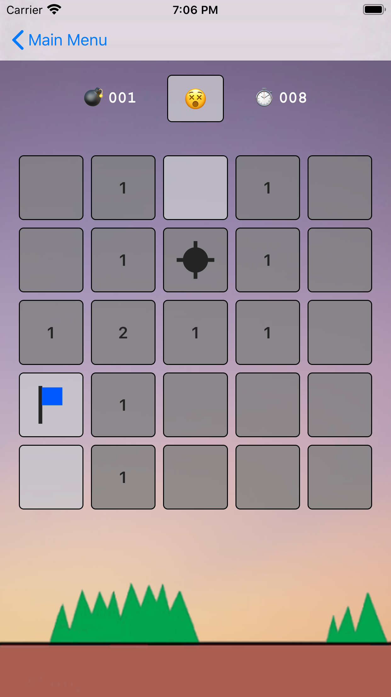
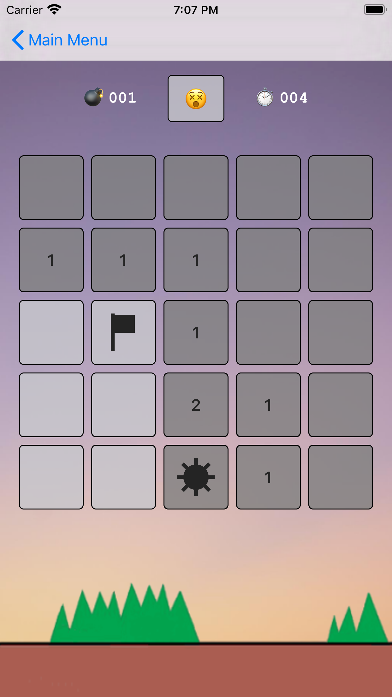
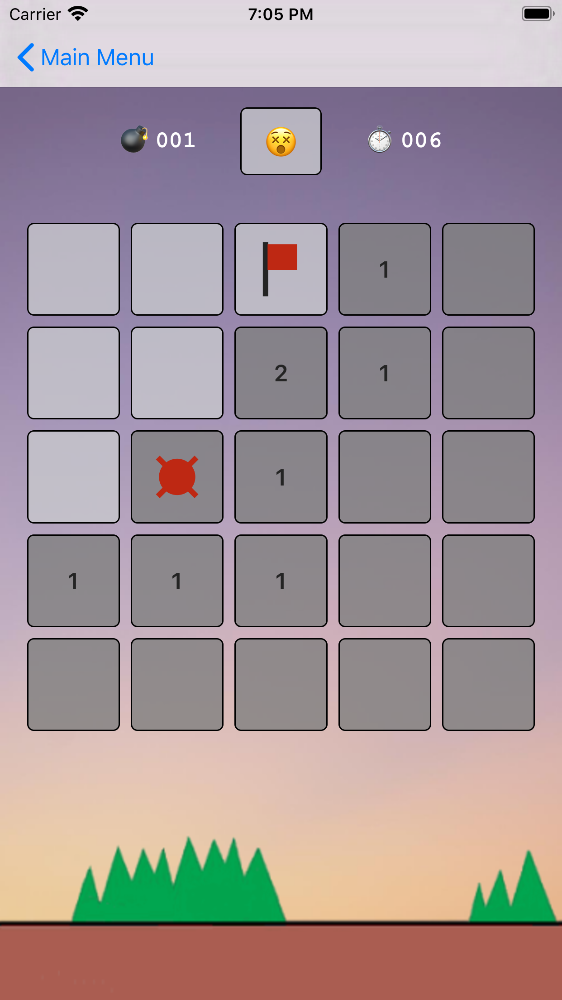
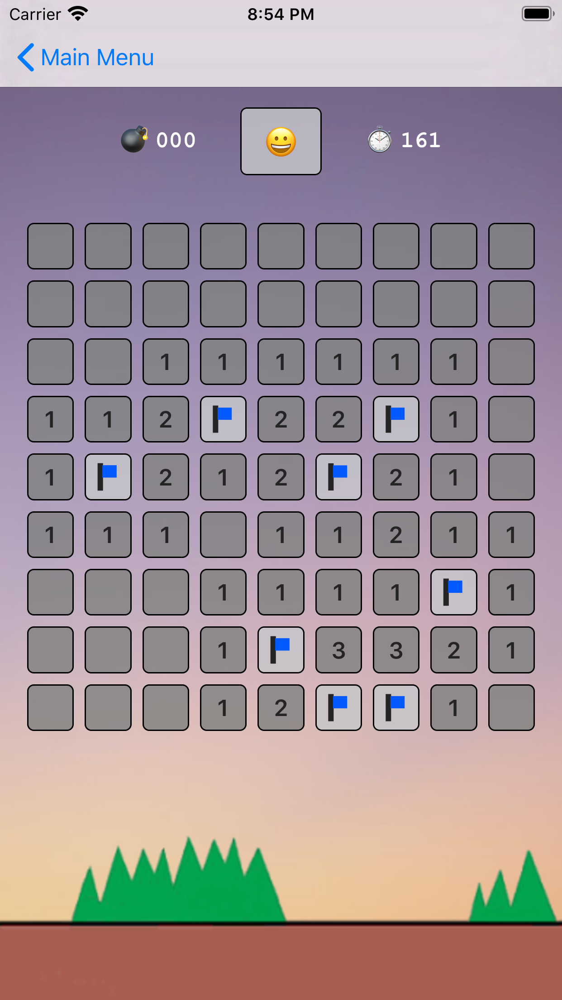

# Minesweeper

## Features:
  * Classic Minesweeper UI
  * User-chosen board size
  * Selectable and customizable difficulty
  * Themes for gameboard icons
  * Split view for landscape orientation
 

<table>
    <thead>
        <tr>
            <th>Usermenu</th>
            <th>Gameboard</th>
            <th>Preferences</th>
            <th>Instructions</th>
        </tr>
    </thead>
    <tbody>
        <tr>
            <td></td>
            <td></td>
            <td></td>
            <td></td>
        </tr>
    </tbody>
</table>

<table>
    <thead>
        <tr>
            <th colspan=3>Themes for gameboard icons</th>
            <th>Adjustable board size</th>
        </tr>
    </thead>
    <tbody>
        <tr>
            <td></td>
            <td></td>
            <td></td>
            <td></td>
        </tr>
    </tbody>
</table>

 
<i>More screenshots can be found in the <b>screenshots</b> folder.</i>
